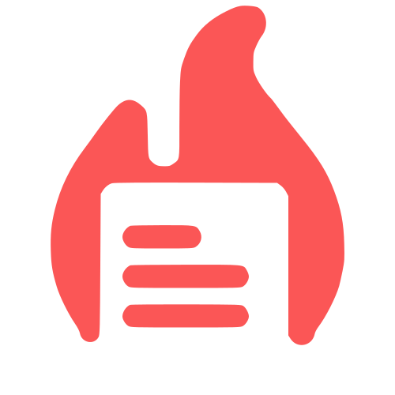
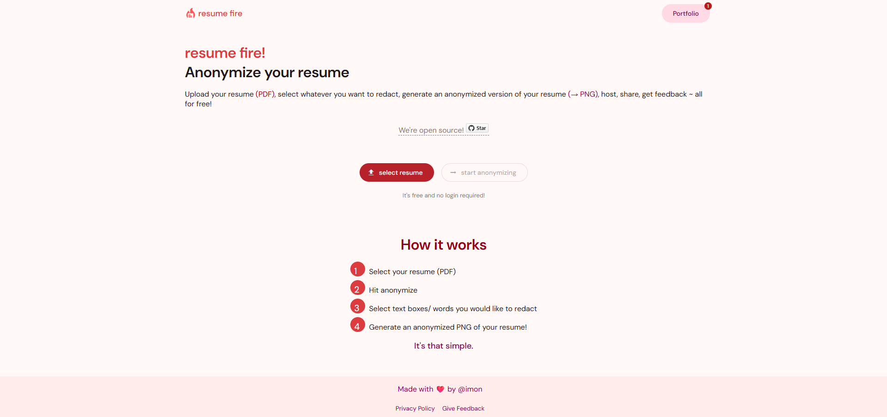

      

 

<h2 align="center">resumefire.io</h2>

resumefire.io is an tool that lets users anonymize their resumes. It is free, fast and requires no login to use. Automatically converts PDF to PNG.

Built with [Angular](https://github.com/angular/angular), [Go](https://github.com/golang/go), [Tesseract](https://github.com/tesseract-ocr/tesseract), and [PDFium](https://github.com/PDFium/PDFium)

Live site hosted at https://resumefire.io using Digital Ocean + CloudFlare

### Features
* PDF text detection and redaction
* PDF to PNG conversion
